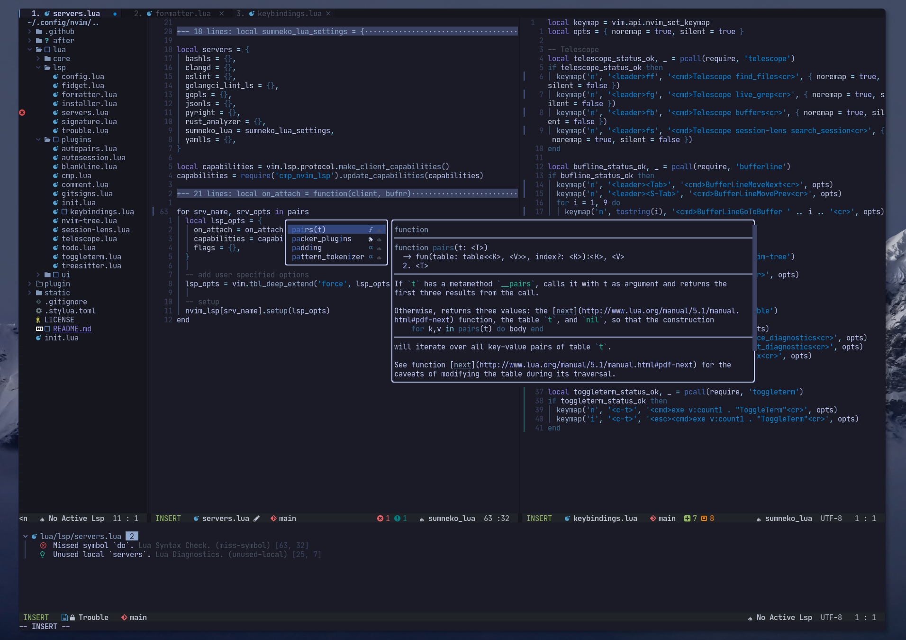

<h1 align="center">🐙 krakenvim</h1>

  

  

  <b>krakenvim</b> is an extensible modular configuration written in Lua, which turns Neovim into a modern code editor with IDE-like features, while keeping it fast and efficient.

## Main features

- [lspconfig](https://github.com/neovim/nvim-lspconfig) to easily config the native LSP client
- [Telescope](https://github.com/nvim-telescope/telescope.nvim) as fuzzy finder for files and buffers
- [trouble](https://github.com/folke/trouble.nvim) for code diagnostics
- [Treesitter](https://github.com/nvim-treesitter/nvim-treesitter) for enhanced syntax highlighting
- [nvim-cmp](https://github.com/hrsh7th/nvim-cmp) for autocompletion
- [LuaSnips](https://github.com/L3MON4D3/LuaSnip) for snippets
- [lualine](https://github.com/nvim-lualine/lualine.nvim) as statusline
- [gitsigns](https://github.com/lewis6991/gitsigns.nvim) for git integration
- [Neo-tree](https://github.com/nvim-neo-tree/neo-tree.nvim) as file browser with diagnostic and git support
- [formatter](https://github.com/mhartington/formatter.nvim) for code formatting
- [auto-session](https://github.com/rmagatti/auto-session) and [session-lens](https://github.com/rmagatti/session-lens) to save and restore sessions

## Installation

### Requirements

- Neovim (v0.7+)
- curl
- npm (NodeJS)
- ripgrep
- lazygit

### Optional requirements

Depending on the programming language you need support for, the following tools may need to be installed.

- `goimports`
- `golines`
- `black`
- `prettier`
- `stylua`
- `yamllint`
