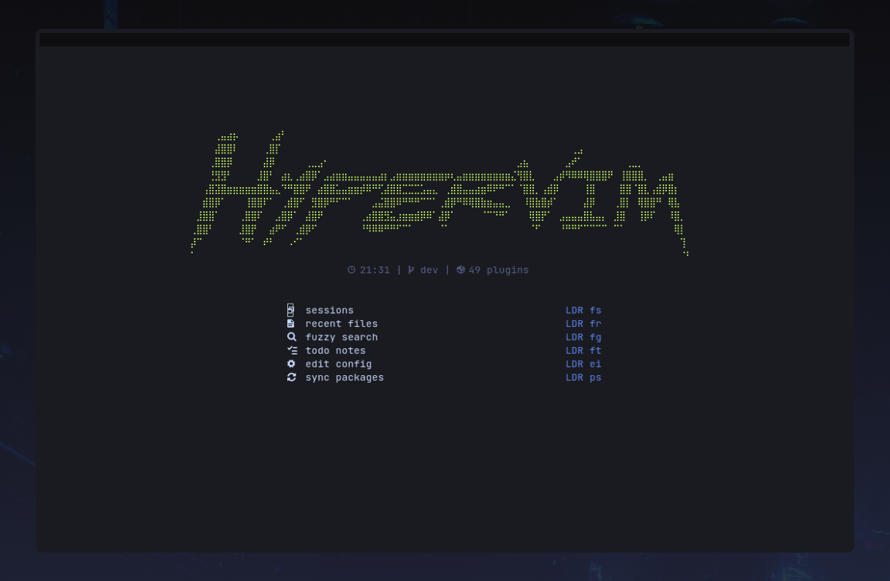
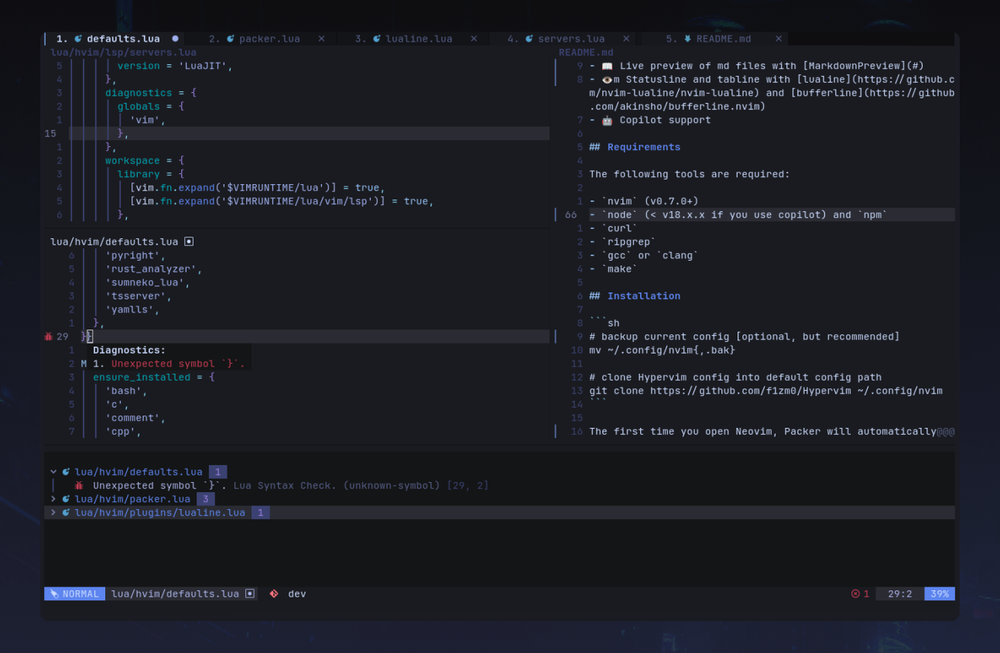
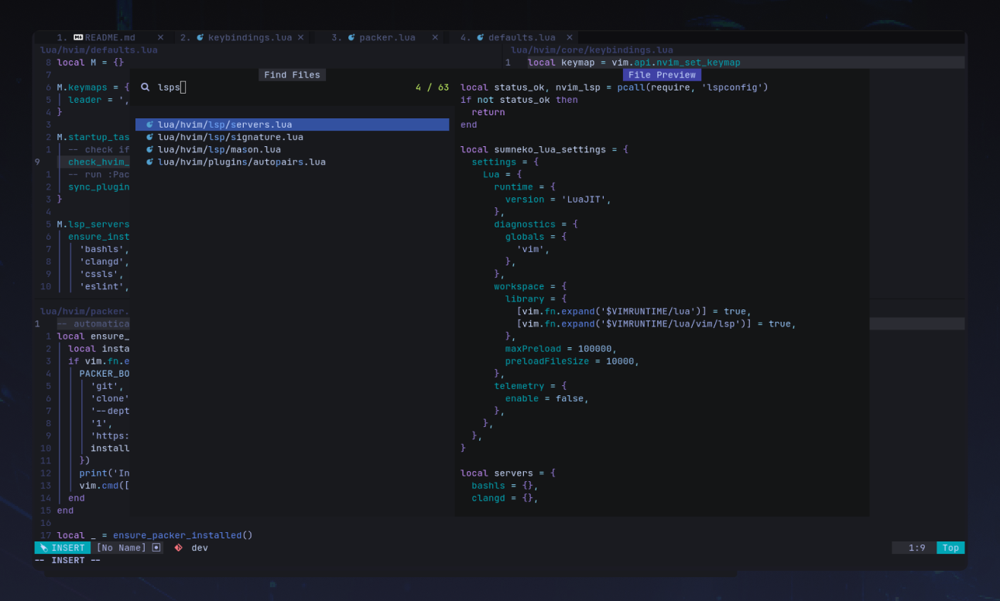
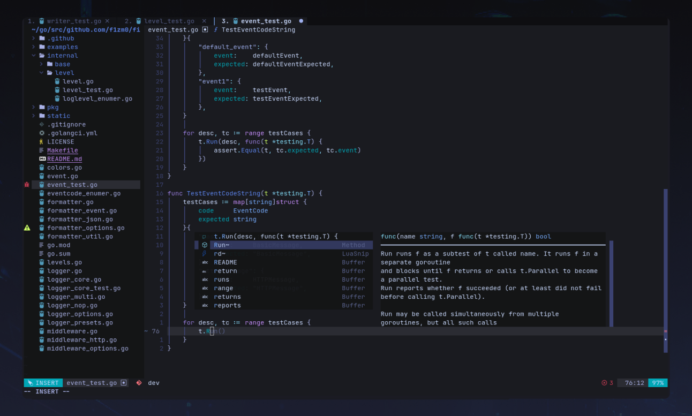

<p align="center">
    
</p>
<p align="center">
  <a href="https://github.com/f1zm0/Hypervim/releases">
    
</a>
  <a href="https://github.com/f1zm0/Hypervim/commits/master">
    
  </a>
<a href="https://github.com/f1zm0/Hypervim">
    
</a>
<br/>
<a href="https://github.com/f1zm0/Hypervim/issues">
    
  </a>
<a href="#">  </a>
    <a href="https://twitter.com/intent/follow?screen_name=f1zm0">
      
    </a>
</p>

<p align="center">
  Hypervim is a modular and rice-friendly configuration written in Lua, that extends Neovim into a modern code editor with IDE-like features, while maintaining its speed.
</p>

<p align="center">
  <a href="#-features">Features</a> •
  <a href="#installation">Installation</a> •
  <a href="#%EF%B8%8F-keymaps">Keymaps</a>
</p>

## ☄️ Showcase

<p align="center">
 <a href="static/showcase/01.png" target="_blank">
    
 </a>
 <a href="static/showcase/02.png" target="_blank">
     
 </a>
 <a href="static/showcase/03.png" target="_blank">
    
 </a>
 <a href="static/showcase/04.png" target="_blank">
    
 </a>
</p>

## ✨ Features

- 💡 Linting, Completion and formatting with [native LSP](https://neovim.io/doc/user/lsp.html), [nvim-cmp](https://github.com/hrsh7th/nvim-cmp) and [null-ls](https://github.com/jose-elias-alvarez/null-ls.nvim)
- 🩺 Diagnostics and quickfixes with [Trouble](https://github.com/folke/trouble.nvim)
- 🔀 Git integration with [gitsigns](https://github.com/lewis6991/gitsigns.nvim), [diffview](https://github.com/indrets/diffview.nvim) and [Neogit](https://github.com/TimUntersberger/neogit)
- ⚙️ Pain-free management of LSP servers, formatters and DAG adapters with [Mason](https://github.com/williamboman/mason.nvim)
- ✂️ Code snippets powered by [LuaSnip](https://github.com/sirverL3MON4D3/LuaSnip)
- 📁 Simple file browsing with [NvimTree](https://github.com/nvim-tree/nvim-tree.lua)
- 🪟 Session management with [auto-sessions](https://github.com/rmagatti/auto-session) and [session-lens](https://github.com/rmagatti/session-lens)
- 🌐 Live preview of md files with [MarkdownPreview](https://github.com/iamcco/markdown-preview.nvim)
- 👁️ Global statusline and Winbar with [lualine](https://github.com/nvim-lualine/lualine.nvim)
- 🤖 Copilot support with [copilot.lua](https://github.com/zbirenbaum/copilot.lua)

## 🚀 Quickstart

### Requirements

The following tools are required:

- `nvim` (v0.7.0+)
- `node` (< v18.x.x if you use copilot), `npm`, `yarn`
- `curl`
- `ripgrep`
- `gcc` or `clang`
- `make`

### Installation

Install Hypervim configuration with:

```sh
git clone https://github.com/f1zm0/Hypervim && cd Hypervim
./setup.sh
```

This process may take a few minutes. The setup script will take care of:

- cloning the config to `~/.config/hvim` (so that your current neovim config is not overwritten)
- installing Packer and the required plugins.
- Creating a `hvim` launcher so you can run `hvim` for `Hypervim`, and keep `nvim` command for Neovim with standard or current config

> IMPORTANT NOTE: Hypervim is alpha software. I'll do my best to keep the main branch as stable as possible and the documentation up-to-date, but this may not always be guaranteed at this stage.

## ⌨️ Keymaps

Below are some of the most important keymaps. For a more comprehensive list of core and plugin-specific keymaps check out [defaults.lua](lua/hvim/defaults.lua)

<b>Leader key</b>: `,`

<details><summary><code>Basic Keymaps</code> 🗺️</summary>
<p>

| Function                  | Keymap                                     |
| ------------------------- | ------------------------------------------ |
| Close everything and exit | <kbd>leader</kbd><kbd>q</kbd>              |
| Sync packages             | <kbd>leader></kbd><kbd>p</kbd><kbd>s</kbd> |
| Delete buffer             | <kbd>leader></kbd><kbd>d</kbd>             |
| Close window              | <kbd>leader></kbd><kbd>c</kbd>             |
| Expand window             | <kbd>leader></kbd><kbd>z</kbd>             |
| Open file explorer        | <kbd>leader></kbd><kbd>e</kbd>             |

</p>
</details>

<details><summary><code>Navigation</code> 🧭</summary>
<p>

| Function                  | Keymap                         |
| ------------------------- | ------------------------------ |
| Navigate to left window   | <kbd>Ctrl</kbd><kbd>h</kbd>    |
| Navigate to right window  | <kbd>Ctrl</kbd><kbd>l</kbd>    |
| Navigate to top window    | <kbd>Ctrl</kbd><kbd>k</kbd>    |
| Navigate to bottom window | <kbd>Ctrl</kbd><kbd>j</kbd>    |
| Horizontal split          | <kbd>\\</kbd>                  |
| Vertical split            | <kbd>\|</kbd>                  |
| Next buffer               | <kbd>Tab</kbd>                 |
| Previous buffer           | <kbd>Shift</kbd><kbd>Tab</kbd> |

</p>
</details>

<details><summary><code>Telescope </code> 🔭 </summary>
<p>

| Function                | Keymap                                    |
| ----------------------- | ----------------------------------------- |
| Find files (fzf syntax) | <kbd>leader</kbd><kbd>f</kbd><kbd>f</kbd> |
| Find buffers            | <kbd>leader</kbd><kbd>f</kbd><kbd>b</kbd> |
| Find notifications      | <kbd>leader</kbd><kbd>f</kbd><kbd>n</kbd> |
| Find with ripgrep       | <kbd>leader</kbd><kbd>f</kbd><kbd>g</kbd> |
| Next result             | <kbd>Ctrl</kbd><kbd>n</kbd>               |
| Previous result         | <kbd>Ctrl</kbd><kbd>p</kbd>               |

</p>
</details>

<details><summary><code>Completion</code> ✨</summary>
<p>

| Function             | Keymap                          |
| -------------------- | ------------------------------- |
| Open completion menu | <kbd>Ctrl</kbd><kbd>Space</kbd> |
| Next suggestion      | <kbd>Ctrl</kbd><kbd>n</kbd>     |
| Previous suggestion  | <kbd>Ctrl</kbd><kbd>p</kbd>     |
| Accept suggestion    | <kbd>Enter</kbd>                |

</p>
</details>

<details><summary><code>LSP</code> ⚙️</summary>
<p>

| Function                     | Keymap                           |
| ---------------------------- | -------------------------------- |
| Go to definition             | <kbd>g</kbd><kbd>d</kbd>         |
| Go to declaration            | <kbd>g</kbd><kbd>D</kbd>         |
| Show references              | <kbd>g</kbd><kbd>r</kbd>         |
| Rename hovered item          | <kbd><leader>r</kbd><kbd>n</kbd> |
| Show info about hovered item | <kbd>K</kbd>                     |

</p>
</details>

<details><summary><code>Diagnostics</code> 🩺</summary>
<p>

| Function                                 | Keymap                                    |
| ---------------------------------------- | ----------------------------------------- |
| Toggle (trouble) diagnostics panel       | <kbd>leader</kbd><kbd>t</kbd><kbd>t</kbd> |
| Show error or warning at hovered line    | <kbd>T</kbd>                              |
| Toggle preview of hovered trouble item   | <kbd>P</kbd>                              |
| Open hovered trouble item in a new split | <kbd>Ctrl</kbd><kbd>x</kbd>               |
| Open hovered trouble item in a new tab   | <kbd>Ctrl</kbd><kbd>t</kbd>               |

</p>
</details>

<details><summary><code>Markdown </code> 📜</summary>
<p>

| Function         | Keymap                                    |
| ---------------- | ----------------------------------------- |
| :MarkdownPreview | <kbd>leader</kbd><kbd>m</kbd><kbd>p</kbd> |
| :GenTOCGFM       | <kbd>leader</kbd><kbd>m</kbd><kbd>t</kbd> |

</p>
</details>

## 🤖 Copilot support

When you want to start using Copiot, you first need to run `:Copilot auth` command, and complete the authentication process.

For more info refer to the [plugin documentation](https://github.com/zbirenbaum/copilot.lua)

## 🛠️ Troubleshooting

### Markdown-Preview dependencies

If you run `:MarkdownPreview` and get an error message saying that `tslib` is not installed, you may need to install its dependencies manually, by going into `~/.local/share/nvim/site/pack/packer/start/markdown-preview.nvim` and running `yarn install`.

The issue is tracked here: [iamcco/markdown-preview/issues/188](https://github.com/iamcco/markdown-preview.nvim/issues/188)

## 🤝 Contributing

Any kind of contribution is welcome.

If you have any suggestions, ideas or bug reports, please open an issue.

## 🙏 Acknowledgements

Big shout-out to the Neovim community and to the creators of the following projects that have inspired this configuration:

- [LunarVim by Chris Chiarulli & contributors](https://github.com/LunarVim/LunarVim)
- [NvChad by siduck & contributors](https://github.com/NvChad/NvChad)
- All [plugins](lua/hvim/packer.lua#35) authors and contributors

## 📖 License

This project is licensed under the GPL 3.0 License - see the [LICENSE](LICENSE) file for details.
